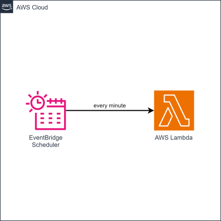

# cdk-aws-cron-function

CDK app that triggers a Lambda function at a specified regular interval.

### Related Apps

- [cdktf-gcp-cron-function](https://github.com/garysassano/cdktf-gcp-cron-function) - Uses GCP instead of AWS; built with CDKTF instead of AWS CDK.

## Prerequisites

- **_AWS:_**
  - Must have completed the [CDK bootstrapping](https://docs.aws.amazon.com/cdk/v2/guide/bootstrapping.html) for the target AWS environment.
- **_Node.js + npm:_**
  - Must be [installed](https://docs.npmjs.com/downloading-and-installing-node-js-and-npm) in your system.

## Installation

```sh
npx projen install
```

## Deployment

```sh
npx projen deploy
```

## Cleanup

```sh
npx projen destroy
```

## Architecture Diagram


